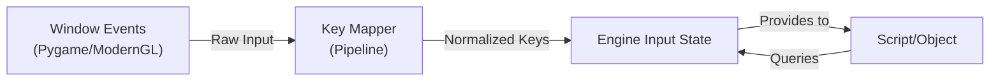
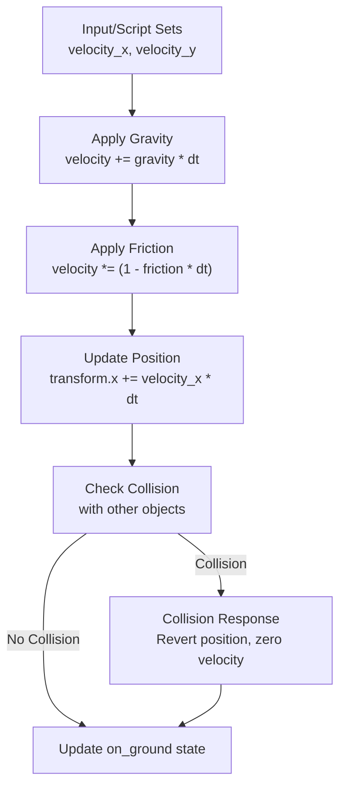
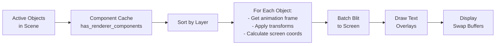
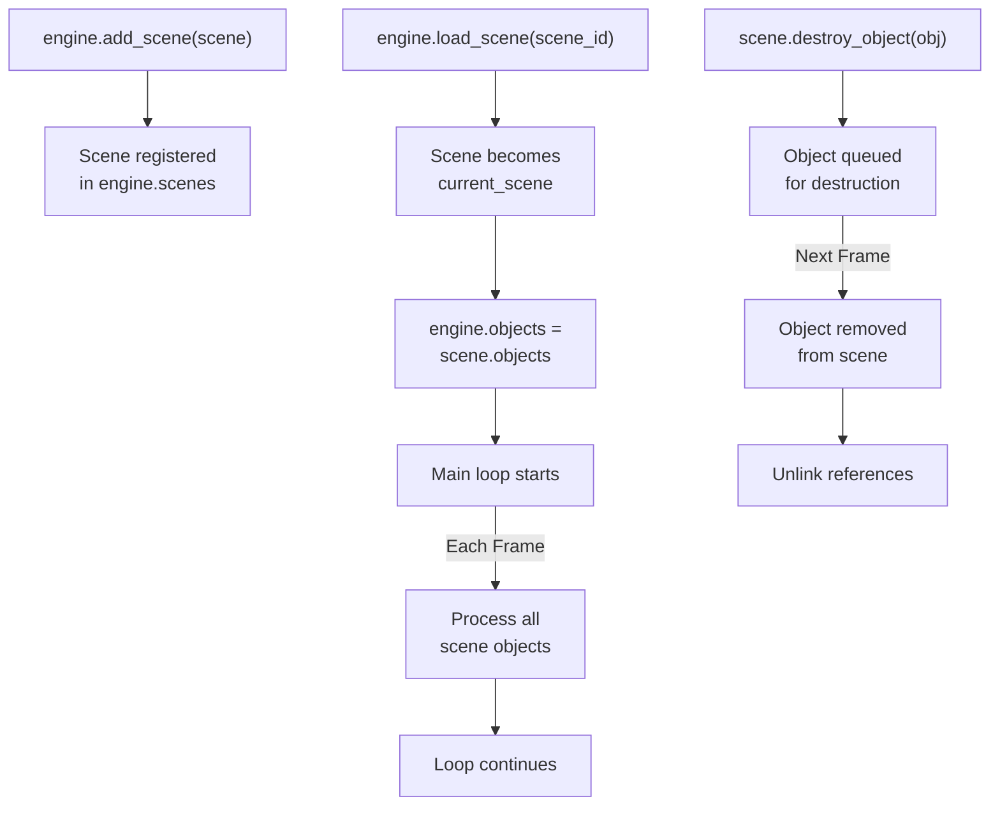
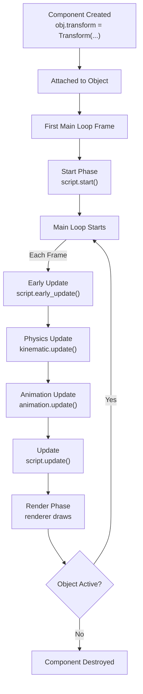

# Data Flow & Control Flow

This document explains how data flows through ForgeEngine and how different systems communicate.

## Data Flow: Input to Output

### Input Processing Flow



### Example: Player Movement

```python
# Frame 1: Input arrives
# Raw: SDLK_LEFT pressed
# Mapped to: Key.LEFT
# In Engine: Key.LEFT added to pressed_keys

# Frame 2: Script queries
if engine.get_key(ForgeEngine.Key.LEFT):
    player.kinematic.velocity_x = -500

# Engine updates physics with new velocity
# Renderer draws player at new position
```

## Physics Simulation Flow



### Physics Example

```python
# Initial state
kinematic.velocity_y = 0
kinematic.on_ground = True
kinematic.gravity = 2000

# Frame 1 (player jumps)
kinematic.velocity_y = -800  # Jump velocity
kinematic.on_ground = False

# Frame 2 (falling)
# Physics update:
# 1. Apply gravity: velocity_y += 2000 * deltaTime
# 2. Apply friction: velocity_y *= (1 - 5 * deltaTime)
# 3. Update position: transform.y += velocity_y * deltaTime
# 4. Check collision: check if touching ground
# 5. If collision: velocity_y = 0, on_ground = True
```

## Rendering Pipeline Flow



### Rendering Example

```python
# Setup
player.renderer = Renderer(image_id=player_img, layer=10)
player.animation = Animation([frame1, frame2, ...])

# During render phase:
# 1. Collect all renderer components
# 2. Sort by layer (10 in this case)
# 3. For player object:
#    - Get current animation frame (frame2)
#    - Get position from transform (400, 300)
#    - Apply camera transform
#    - Schedule blit(frame2, screen_pos, rotation, scale)
# 4. Blit all scheduled graphics
# 5. Draw text overlays
# 6. Update screen
```

## Scene Lifecycle



## Component Lifecycle



## Object Destruction Flow

```python
# Object marked for destruction
scene.destroy_object(obj)
# → obj added to scene.objects_to_destroy

# Next frame, during main loop:
engine.destroy_objects()
# → For each obj in scene.objects_to_destroy:
#   - Remove from scene.objects
#   - Remove references to components
#   - Next frame, obj is no longer updated

# Best practice: Always use scene.destroy_object()
# Don't remove directly from scene.objects
```

## Event Propagation

### Window Events

```mermaid
graph LR
    Window["Window<br/>(Pygame/ModernGL)"]
    Window -->|get_events()| Engine["Engine"]
    Engine -->|Check for QUIT| GameLoop["Game Loop"]
    GameLoop -->|QUIT found| Stop["Stop running"]
```

### Input Events

```python
# Each frame:
# 1. engine.handle_input() is called
# 2. Window provides raw input (keyboard, mouse)
# 3. Input is mapped to Key constants
# 4. Current state is tracked:
#    - pressed_keys: currently held
#    - frame_pressed_keys: just pressed this frame
#    - frame_released_keys: just released this frame
# 5. Scripts query via engine.get_key(), etc.
```

## Memory Management

### Object References

```python
# When you create an object:
obj = ForgeEngine.Object(engine)
scene.add_object(obj)

# References:
# - obj variable
# - scene.objects list
# - Various caches (has_renderer_components, etc.)

# When you destroy:
scene.destroy_object(obj)

# Next frame:
# - Removed from scene.objects
# - Removed from caches
# - Old reference (obj variable) becomes orphaned
# - Python garbage collector cleans up
```

## Data Structure Example

### Scene State

```python
scene = ForgeEngine.Scene("main")

# Objects in scene
scene.objects = [
    player_obj,
    camera_obj,
    ground_obj,
    # ... more objects
]

# Engine caches by component type
engine.has_renderer_components = [player_obj, ground_obj, ...]
engine.has_kinematic_components = [player_obj, ...]
engine.has_camera_components = [camera_obj]
engine.has_animation_components = [player_obj, ...]

# Camera reference
engine.cameras = {
    1: camera_obj  # camera_id -> object
}
engine.camera = camera_obj  # Current active camera
```

## Communication Patterns

### Script to Engine

```python
# Scripts communicate with engine via method calls
class PlayerScript:
    def update(self, thisObject, engine):
        # Query input
        if engine.get_key(ForgeEngine.Key.W):
            pass
        
        # Modify object components
        thisObject.kinematic.velocity_x = 500
        thisObject.animation.play()
        
        # Access other objects (via engine.objects)
        for obj in engine.objects:
            if obj.has_tag("enemy"):
                # Do something
                pass
        
        # Access engine systems
        mouse_x, mouse_y = engine.world_mouse_position
```

### Engine to Script

```python
# Engine calls script methods
class PlayerScript:
    def start(self, thisObject, engine):
        # Called once at startup
        pass
    
    def early_update(self, thisObject, engine):
        # Called before physics
        pass
    
    def update(self, thisObject, engine):
        # Called after physics
        pass
```

## Performance Implications

### Component Caching
- Collecting components each frame is O(n) where n = number of objects
- Caching allows systems to process only relevant objects
- Example: Only 5 objects with animation out of 100 total objects

### Layer Sorting
- Objects are sorted by layer each frame
- Important for correct depth rendering
- Insertion/retrieval is fast for typical game sizes

### Collision Detection
- SAT algorithm is O(n²) in worst case
- Typically much faster in practice
- Consider spatial partitioning for large numbers of colliders

## Data Flow Summary

```
Input Events
    ↓
Key Mapping
    ↓
Engine Input State
    ↓
Scripts (early_update)
    ↓
Physics System
    ↓
Collision System
    ↓
Scripts (update)
    ↓
Animation System
    ↓
Rendering System
    ↓
Audio System
    ↓
Display
```
