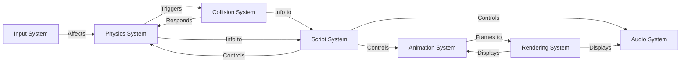

# Game Systems

ForgeEngine consists of several major systems that work together to provide a complete game engine. This document explains each system and how they interact.

## 1. Input System

### Responsibilities
- Collect keyboard and mouse input from the window
- Map raw input to engine key constants
- Track key state (pressed, released, held)
- Track mouse position and button state

### Components
- **keys.py** - Key constants (Key.W, Key.LEFT, Key.MOUSE_LEFT, etc.)
- **pygameKeyMapping.py** - Maps pygame events to Key constants
- **modernglKeyMapping.py** - Maps moderngl/glfw events to Key constants

### Key State Tracking

ForgeEngine tracks three types of key states:

```python
# Held - key is currently pressed
if engine.get_key(ForgeEngine.Key.W):
    player.move_forward()

# Pressed - key was pressed this frame
if engine.get_key_down(ForgeEngine.Key.SPACE):
    player.jump()

# Released - key was released this frame
if engine.get_key_up(ForgeEngine.Key.ESC):
    show_pause_menu()
```

### Mouse Input

```python
# Current state
if engine.get_mouse_button(ForgeEngine.Key.MOUSE_LEFT):
    print("Left button held")

# Pressed this frame
if engine.get_mouse_button_down(ForgeEngine.Key.MOUSE_RIGHT):
    print("Right clicked")

# Mouse position
screen_x, screen_y = engine.screen_mouse_position
world_x, world_y = engine.world_mouse_position
```

## 2. Physics System

### Responsibilities
- Apply gravity to objects
- Update velocity and position
- Handle friction
- Manage collision response
- Track ground state

### Component: Kinematic

```python
kinematic = ForgeEngine.Kinematic()
kinematic.gravity = 2000              # Gravity acceleration (pixels/s²)
kinematic.gravity_direction = 90      # Direction gravity pulls (degrees)
kinematic.friction = 5                # Air friction
kinematic.velocity_x = 0              # Current X velocity
kinematic.velocity_y = 0              # Current Y velocity
kinematic.on_ground = False           # Is object on ground?
```

### Physics Update Order

1. Apply gravity (if not on ground)
2. Apply friction
3. Update position based on velocity
4. Check collisions
5. Resolve collisions (revert position, reset velocity)
6. Update ground state

## 3. Collision System

### Responsibilities
- Detect collisions between objects
- Support multiple collision shapes (Rectangle, Polygon)
- Implement Separating Axis Theorem (SAT) algorithm
- Provide collision response handling

### Supported Shapes

**Rectangle**
```python
collider = ForgeEngine.Collider(
    shape=ForgeEngine.Rectangle(width=64, height=64),
    x_offset=0,
    y_offset=0
)
```

**Polygon** (must be convex)
```python
points = [(0, 0), (100, 0), (100, 100), (0, 100)]
collider = ForgeEngine.Collider(
    shape=ForgeEngine.Polygon(points),
    x_offset=0,
    y_offset=0
)
```

### How Collision Works

1. Separating Axis Theorem (SAT) checks if shapes overlap
2. All potential separating axes are tested
3. If any axis separates the shapes, no collision
4. If no axis separates, collision detected

### Collision Response

For kinematic objects:
- Position is reverted
- Velocity is zeroed along collision axis
- Ground state is updated if collision is below object

## 4. Rendering System

### Responsibilities
- Render all visible objects
- Handle sprite rendering with layers
- Render text
- Manage camera viewport
- Clear screen and swap buffers

### Rendering Pipeline

ForgeEngine supports multiple rendering backends:

**Pygame Pipeline**
```python
engine = ForgeEngine.Engine(render_pipeline=ForgeEngine.pygamePipeline)
```
- Easy to use, good for 2D
- Good performance for most games
- Well-supported and documented

**ModernGL Pipeline**
```python
engine = ForgeEngine.Engine(render_pipeline=ForgeEngine.modernGlPipeline)
```
- Modern OpenGL API
- Higher performance
- Requires OpenGL drivers

### Layer System

Objects are rendered in layer order (lower numbers rendered first):

```python
# Background
bg_renderer = ForgeEngine.Renderer(image_id=bg_image, layer=0)

# Mid-ground (player)
player_renderer = ForgeEngine.Renderer(image_id=player_image, layer=10)

# Foreground (UI)
ui_renderer = ForgeEngine.Renderer(image_id=ui_image, layer=100)
```

### Camera System

Cameras control the viewport:

```python
camera = ForgeEngine.Object(engine)
camera.transform = ForgeEngine.Transform(x=0, y=0)
camera.camera = ForgeEngine.Camera(camera_id=1)
camera.camera.render_zone_width = 1280
camera.camera.render_zone_height = 720
```

## 5. Animation System

### Responsibilities
- Update sprite animation frames
- Handle animation playback
- Support looping and one-shot animations
- Integrate with rendering system

### Component: Animation

```python
animation = ForgeEngine.Animation(
    frame_ids=[img1, img2, img3],    # Sprite frames
    frame_duration=0.1,              # Duration per frame
    loop=True,                       # Loop when finished?
    playing=True                     # Currently playing?
)

# Control playback
animation.play()    # Start/resume
animation.pause()   # Pause
animation.stop()    # Stop and reset
animation.reset()   # Reset to frame 0
```

### Integration with Renderer

The renderer automatically uses animation frames:

```python
# Renderer shows current animation frame if animation exists
player.renderer = ForgeEngine.Renderer(image_id=default_img, layer=1)
player.animation = ForgeEngine.Animation([frame1, frame2, frame3], ...)
# Renderer will display animation frames, not default_img
```

## 6. Audio System

### Responsibilities
- Load and manage audio files
- Play and stop audio
- Control audio playback

### Component: Audio

```python
audio = ForgeEngine.Audio(audio_id=sound_effect)
audio.play_sound()   # Queue sound to play this frame
audio.stop_sound()   # Queue sound to stop this frame
```

## 7. Scripting System

### Responsibilities
- Execute custom code for each object
- Provide lifecycle methods
- Enable custom game logic

### Script Lifecycle

```python
class MyScript:
    def start(self, thisObject, engine):
        """Called once when scene loads"""
        pass
    
    def early_update(self, thisObject, engine):
        """Called before physics"""
        pass
    
    def update(self, thisObject, engine):
        """Called after physics"""
        pass
```

### Attaching Scripts

```python
obj = ForgeEngine.Object(engine)
obj.script = MyScript()
scene.add_object(obj)
```

## System Interaction Diagram



## System Update Order (Per Frame)

1. **Input** - Collect keyboard/mouse input
2. **Script (Early Update)** - Custom early logic
3. **Physics** - Apply forces and velocities
4. **Collision** - Detect and respond to collisions
5. **Animation** - Update animation frames
6. **Script (Update)** - Custom post-physics logic
7. **Rendering** - Draw all visible objects
8. **Audio** - Play/stop audio
9. **Time** - Update timers

## Component Caching

To optimize performance, ForgeEngine caches components:

```python
# Engine collects all components each frame
self.has_renderer_components = []
self.has_collider_components = []
self.has_kinematic_components = []
# ... etc for all component types

# Only update objects with specific components
for obj in self.has_kinematic_components:
    obj.kinematic.update(obj, self)
```

This means:
- Adding/removing components affects behavior next frame
- Only active objects in the scene are cached
- Improves performance by avoiding unnecessary iterations
